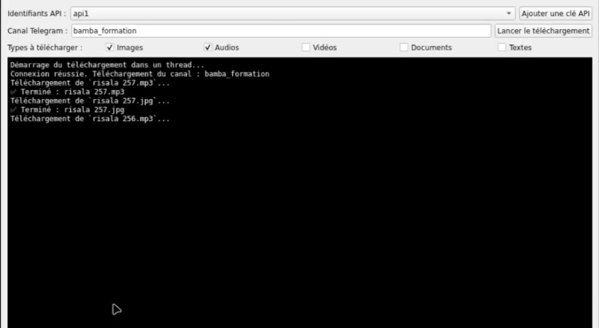

# 🚀 Telegram Medias Fast Downloader

<p align="center">
  
</p>

## 📌 Description

**Telegram Medias Fast Downloader** est une application **Python / PyQt5** permettant de télécharger rapidement les médias provenant d’un canal Telegram.
Elle utilise **l’API officielle de Telegram (Telethon)** et offre une interface intuitive avec filtres avancés pour sélectionner les types de fichiers à récupérer.

Cette application a été conçue pour être simple, rapide et accessible même aux débutants.

---

## 🎯 Fonctionnalités

### ✅ **1. Téléchargement Multi-Médias**

Choisissez exactement ce que vous voulez télécharger :

* 🖼️ Images
* 🎵 Audios
* 🎬 Vidéos
* 📄 Documents
* 📝 Textes

Les médias cochés seulement seront téléchargés.

---

### ✅ **2. Gestion des API Telegram**

* Ajouter plusieurs paires **API ID / API Hash**
* Sélectionner celle à utiliser
* Stockage sécurisé dans un fichier JSON
  Parfait pour tester plusieurs comptes développeurs Telegram.

---

### ✅ **3. Interface Moderne PyQt5**

L'application propose :

* Un champ pour saisir **le lien ou l'ID du canal**
* Une série de **cases à cocher** (filtres de média)
* Un bouton **“Lancer le téléchargement”**
* Un panneau latéral type **terminal** qui affiche :

  * logs en temps réel
  * erreurs
  * progression du téléchargement

---

### ⚙️ Technologies

* Python 3
* PyQt5
* Telethon (API Telegram)
* JSON
* Threading (pour éviter le freeze de l’UI)

---

## 📦 Installation

Clonez le projet :

```bash
git clone git@github.com:aliou90/Telegram-Medias-Fast-Downloader.git
cd Telegram-Medias-Fast-Downloader
```

Installez les dépendances :

```bash
pip install -r requirements.txt
```

---

## ▶️ Lancement

```bash
python main.py
```

---

## 🖥️ Aperçu

<p align="center">
  
</p>

---

## 📚 Notes

* Vous devez créer une API Telegram sur : [https://my.telegram.org](https://my.telegram.org)
* Ajoutez ensuite `api_id` et `api_hash` via l'interface de l'application.
* Le téléchargement fonctionne sur **les canaux publics et privés** (si vous êtes membre du canal).

---

## 🧑‍💻 Auteur

**Aliou Mbengue**
Développeur Python & Automatisation
GitHub : [https://github.com/aliou90](https://github.com/aliou90)

---

## 🪪 Licence

Projet libre et modifiable pour usage personnel ou éducatif.

---

